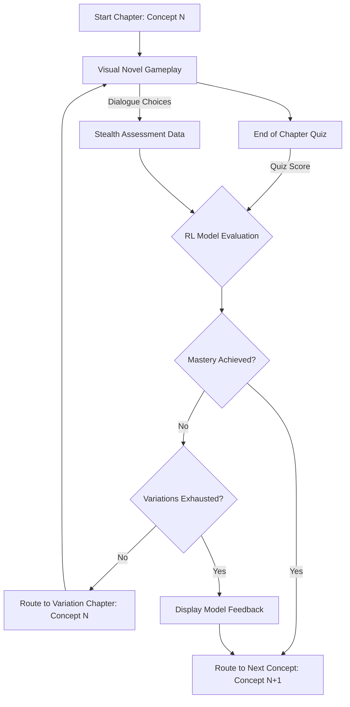

```mermaid
graph TD
    A[Start Chapter: Concept N] --> B[Visual Novel Gameplay]
    B -->|Dialogue Choices| C[Stealth Assessment Data]
    B --> D[End of Chapter Quiz]
    D -->|Quiz Score| E{RL Model Evaluation}
    C --> E
    E --> F{Mastery Achieved?}
    F -- Yes --> G[Route to Next Concept: Concept N+1]
    F -- No --> H{Variations Exhausted?}
    H -- No --> I[Route to Variation Chapter: Concept N]
    I --> B
    H -- Yes --> J[Display Model Feedback]
    J --> G
```
